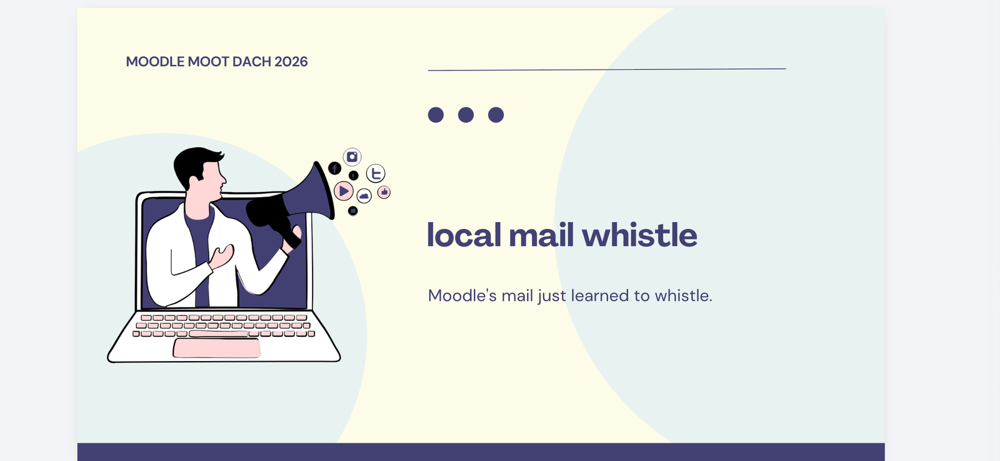
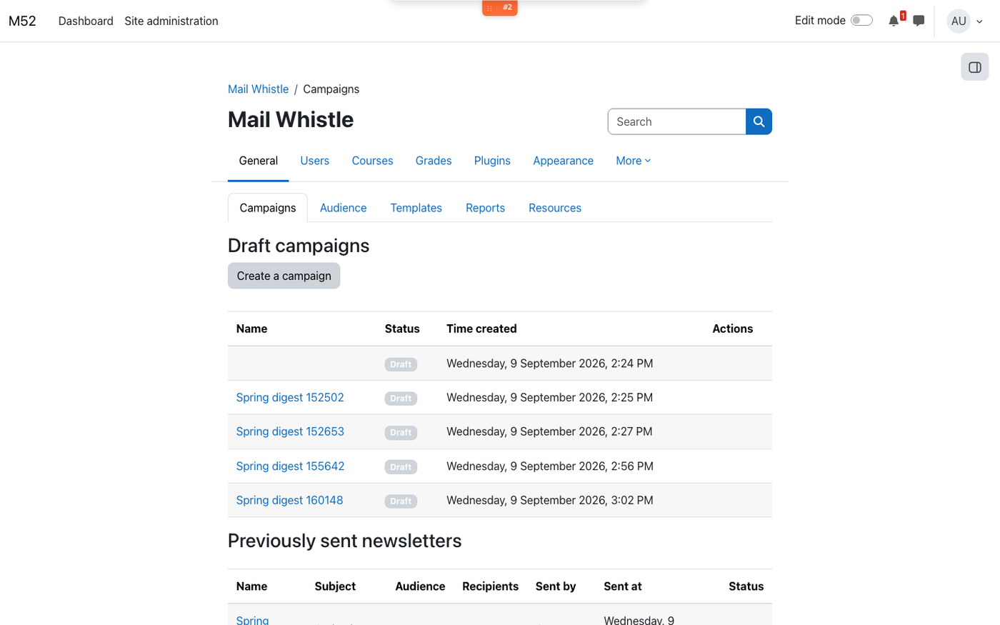
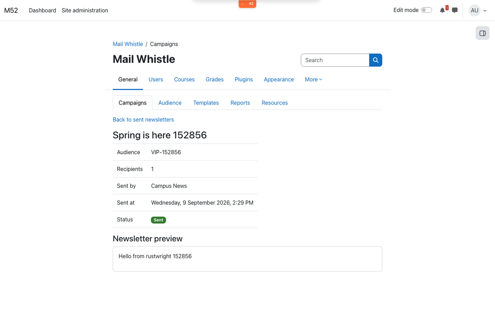
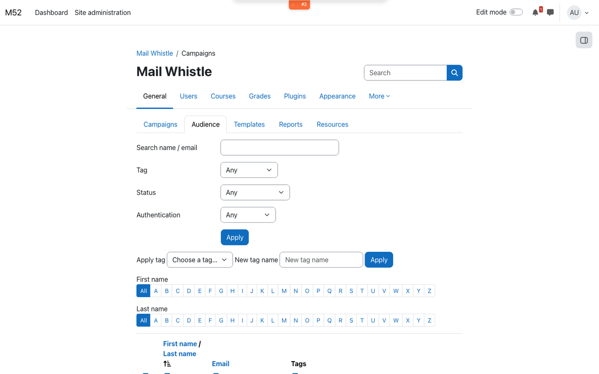
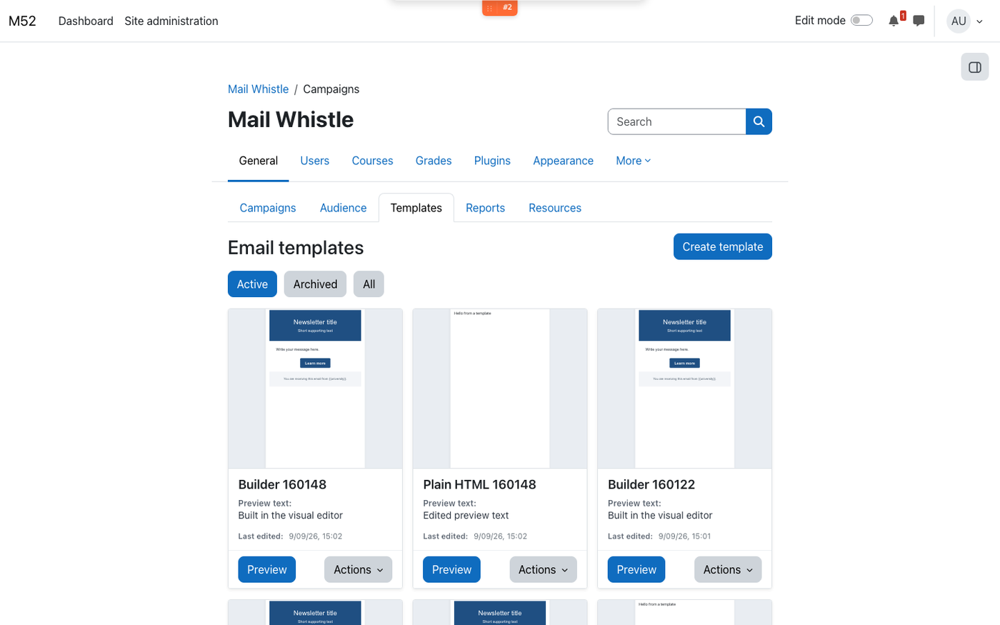
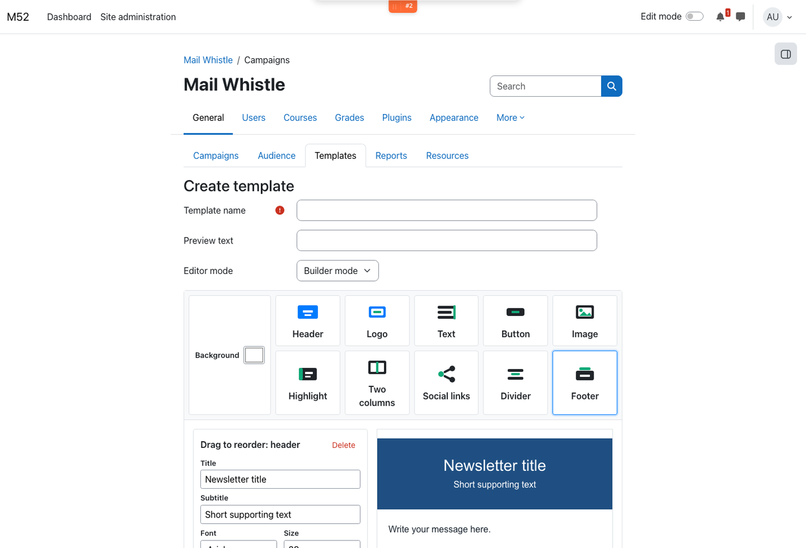

# Mail Whistle

**Moodle's mail just learned to whistle.**

Mail Whistle (`local_mailwhistle`) is a Moodle local plugin for sending newsletters and email campaigns to tagged audiences of site users. It is a **MoodleDach project** (MoodleMoot DACH community). Copyright belongs to the project, not to any one person or company.

> Status: early development (`MATURITY_ALPHA`). Moodle **4.5 LTS through 5.2+**.

Introduced at [Moodle Moot DACH 2026](https://canva.link/p1zpn7lg7fyuisx).

## Why it exists

Moodle already has messaging, but it is built for notifications, not campaigns. Mail Whistle adds a small admin workspace for:

- building HTML newsletters (visual builder or raw HTML)
- targeting people with reusable audience tags
- sending a test copy to yourself before the real send
- delivering in batches through Moodle messaging (so it respects each user's mail settings)
- recording opens and clicks without requiring a Moodle session in the inbox
- seeing who a campaign (and which template) was sent to, with open and click counts

Open it at **Site administration → Mail Whistle**, or `/local/mailwhistle/index.php`.

## What you can do today

| Area | Status |
|------|--------|
| Campaigns (draft → ready → send) | Working |
| Audience tags, filters, assign/remove | Working |
| Email templates + visual builder | Working |
| Test mail to the current user | Working |
| Open / click tracking | Working |
| Image resources for templates | Working |
| Reports and analytics | Working |

### Campaigns

Drafts and previously sent newsletters live on one tab. Create a campaign, walk through **Details → Content → Audience → Review**, send a test copy, mark it ready, then **Send now**. Delivery runs as an ad-hoc task so large audiences can be batched.

A sent campaign keeps its audience, recipient count, sender, time, and a preview of the HTML that went out.

### Audience

Tag users (for example `Newsletter` or `VIP`), then target a campaign at those tags. Filter the list by name/email, tag, active/suspended, and authentication method. Assign a new or existing tag to selected users; remove a tag from a user with a confirm step.

The campaign is sent to everyone tagged with **any** of the selected tags.

### Templates

Reusable layouts for the content step. HTML mode for a pasted body, or **Builder mode** for drag-and-drop blocks (header, logo, text, button, image, highlight, two columns, social links, divider, footer). Templates can be previewed, archived, restored, exported as JSON, and deleted when unused.

Load a template into a campaign from the content step. Placeholders such as `{{firstname}}`, `{{lastname}}`, `{{fullname}}`, and `{{email}}` are filled per recipient at send time. A test copy uses the reviewer's profile so you can see how it looks, without writing tracking events.

### Sending and tracking

- Outgoing mail goes through Moodle's `message_send` campaign provider (email by default).
- The subject of a test copy is prefixed with `[Test]`.
- Live sends rewrite `http(s)` links through `click.php` and append a 1×1 open pixel (`pixel.php`). Tokens are HMAC-signed; click tokens are bound to the target URL (no open redirect).
- Opens are stored once per recipient; clicks once per distinct link.
- Batch size is configurable (**Site administration → Mail Whistle → Settings**, default 50). A scheduled task resumes stalled sends.

### Reports

The Reports tab lists sent and in-progress campaigns with audience tags, the template that was loaded (when one was used), recipient count, unique opens, and unique clicks. Open a campaign to see the snapshotted roster: name, email, send status, whether that person opened or clicked, and any send error. Opens are stored once per recipient; clicks once per person (unique clickers). Campaigns sent before this version have no stored template id.

A sent-campaign preview on the Campaigns tab links through to the same report.

### Resources

Upload images (JPEG, PNG, GIF, WebP) for use in templates and campaign HTML. Files are stored in the system context file area for the plugin. Image URLs from the Resources tab are public `pluginfile.php` links so they load in inboxes without a Moodle login. Non-image files still require login.

## Install

1. Copy this folder to `local/mailwhistle` in your Moodle tree (`public/local/mailwhistle` on Moodle 5.1+ with a `/public` docroot).
2. Visit **Site administration → Notifications** to run the install.
3. Purge caches.

The plugin adds a **Mail Whistle** category under site administration, with Campaigns and Settings.

## Capabilities

All capabilities are system-context. Default archetype: **manager**.

| Capability | Purpose |
|------------|---------|
| `local/mailwhistle:view` | Open the Mail Whistle pages |
| `local/mailwhistle:manage` | Create and send campaigns, manage templates and resources |
| `local/mailwhistle:managetags` | Create, assign, and remove audience tags |
| `local/mailwhistle:configure` | Change plugin settings (send batch size) |

## Privacy

Mail Whistle ships a GDPR privacy provider. It can export and delete campaign authorship, tag assignments, recipient snapshots, send logs, tracking events, and unsubscribes for a user. See `classes/privacy/provider.php`.

## Development

- PHPUnit: `vendor/bin/phpunit --testsuite local_mailwhistle_testsuite` (from a Moodle tree with the plugin installed)
- Behat: scenarios under `tests/behat/` tagged `@local_mailwhistle`
- Coding style: `phpcs --standard=moodle .` (or [moodle-plugin-ci](https://github.com/moodlehq/moodle-plugin-ci))
- AMD: edit `amd/src/template_builder.js`, then `npx grunt amd --root=local/mailwhistle`

## Contributors

Everyone who works on Mail Whistle. See also the [contributors graph](https://github.com/moodlelocalmailwhistle/moodle-local_mailwhistle/graphs/contributors).

- Luca Bösch
- Amir Ahkami
- Davo Smith
- Meret Racz
- Júlia Verdaguer
- Luuk Verhoeven

## Copyright and license

Copyright 2026 onwards MoodleDach project.

GNU GPL v3 or later. See [LICENSE](LICENSE).

Title artwork from the Moodle Moot DACH 2026 presentation ([Canva](https://canva.link/p1zpn7lg7fyuisx)).
